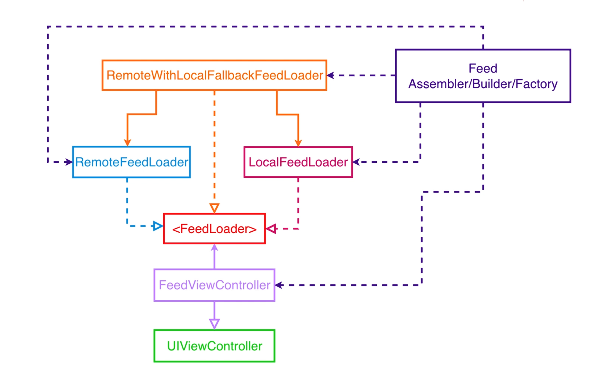
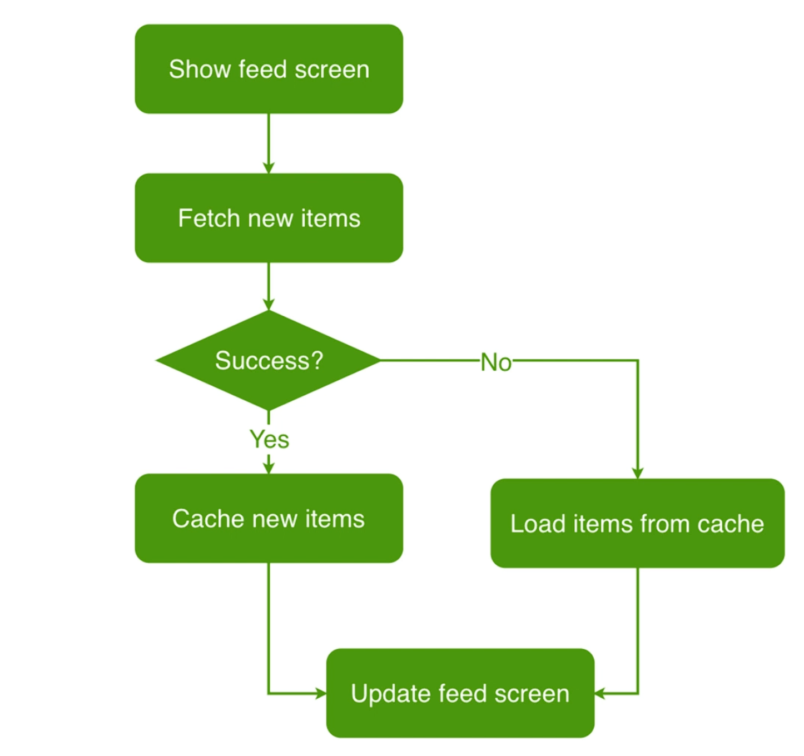

# Essential Feed

Repository created to keep track of the iOS Lead Essentials training program. This repository keeps track of all the lectures in the program with some small twists - using Swift Package Manager to create the modules (frameworks) and using some modern technologies for practice (Swift Testing instead of XCTest). The overall result should be equivalent but it serves to practice the TDD approach while learning new technologies at the same time.

## Requirements

### Image Feed Feature

- [Story: Customer requests to see their image feed][image-feed-feature-bdd-specs]
- Use cases:
    - [Load Feed From Remote Use Case][load-feed-from-remote-use-case]
    - [Load Feed From Cache Use Case][load-feed-from-cache-use-case]
    - [Cache Feed Use Case][cache-feed-use-case]
    - [Validate Feed Cache Use Case][validate-feed-cache-use-case]
    - [Load Feed Image Data From Remote Use Case][load-feed-image-data-from-remote-use-case]
    - [Load Feed Image Data From Cache Use Case][load-feed-image-data-from-cache-use-case]
    - [Cache Feed Image Data Use Case][cache-feed-image-data-use-case]
- [API model][image-feed-feature-api-model]

### Image Comments Feature

- [Story: Image Comments][image-comments-bdd-specs]
- Use cases:
    - [Load Image Comments From Remote Use Case][load-image-comments-from-remote-use-case]
- [API model][image-comments-api-model]
- [UI Specs][image-comments-ui-specs]

<!-- Start Link section -->
[image-feed-feature-bdd-specs]: Docs/image-feed-feature/user-story.md
[image-feed-feature-api-model]: Docs/image-feed-feature/api-model.md

[image-comments-bdd-specs]: Docs/image-comments-feature/user-story.md
[image-comments-api-model]: Docs/image-comments-feature/api-model.md
[image-comments-ui-specs]: Docs/image-comments-feature/ui-specs.md

[load-feed-from-remote-use-case]: Docs/image-feed-feature/load-feed-from-remote-use-case.md
[load-feed-from-cache-use-case]: Docs/image-feed-feature/load-feed-from-cache-use-case.md

[cache-feed-use-case]: Docs/image-feed-feature/cache-feed-use-case.md
[validate-feed-cache-use-case]: Docs/image-feed-feature/validate-feed-cache-use-case.md

[load-feed-image-data-from-remote-use-case]: Docs/image-feed-feature/load-feed-image-data-from-remote-use-case.md
[load-feed-image-data-from-cache-use-case]: Docs/image-feed-feature/load-feed-image-data-from-cache-use-case.md

[cache-feed-image-data-use-case]: Docs/image-feed-feature/cache-feed-image-data-use-case.md

[load-image-comments-from-remote-use-case]: Docs/image-comments-feature/load-image-comments-from-remote-use-case.md
<!-- End Link section -->

## Architecture

## Flowchart

